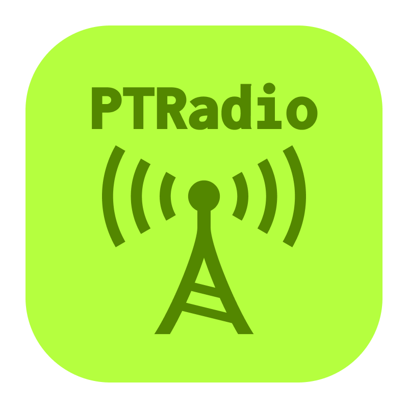
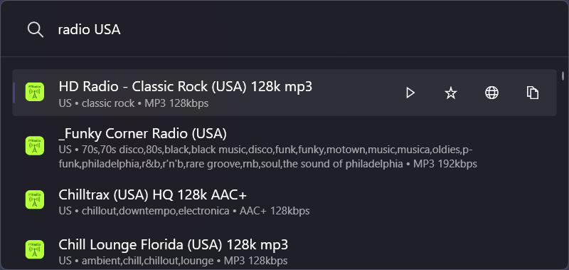
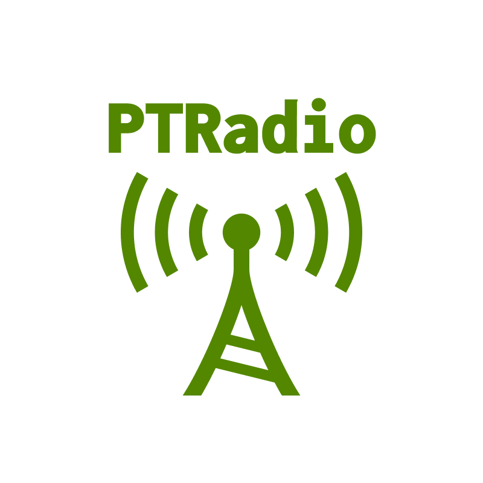

<div align="center">

# 📻 Radio Plugin for PowerToys Run



### _Instant access to 30,000+ radio stations from around the world_

**Stop switching to your browser to find radio streams.**
Search and play radio stations directly from PowerToys Run → `Alt+Space` → `radio london` → Done! ✨

[](https://github.com/ruslanlap/PowerToysRun-Radio/releases/latest)
[](https://github.com/ruslanlap/PowerToysRun-Radio/releases/latest)
[](https://github.com/ruslanlap/PowerToysRun-Radio/stargazers)
[](https://github.com/hlaueriksson/awesome-powertoys-run-plugins)

</div>

---

## 🎯 Why You'll Love It

<div align="center">

**"Listen to your favorite radio stations without opening a browser"**

| ❌ Before                                                    | ✅ With Radio Plugin                |
| ------------------------------------------------------------ | ----------------------------------- |
| Open browser → Google → Find radio → Copy link → Open player | `Alt+Space` → `radio bbc` → Enter   |
| 30+ seconds, lost focus                                      | **2 seconds, no context switching** |

</div>

### 🚀 **Quick Demo** - Try it now

```estella.ua@gmail.com
Alt+Space → radio lviv              # 🇺🇦 Ukrainian stations
Alt+Space → radio bbc               # 🌍 BBC Radio
Alt+Space → radio jazz              # 🎵 Jazz stations
Alt+Space → radio france            # 🇫🇷 French stations
```

<div align="center">

### 📸 How it looks



_Search results with bitrate, codec, country, and tags_

</div>

---

**⬇️ Ready to boost your productivity?**

  <a href="https://github.com/ruslanlap/PowerToysRun-Radio/releases/latest/download/Radio-1.1.0-x64.zip">
    
  </a>
  <a href="https://github.com/ruslanlap/PowerToysRun-Radio/releases/latest/download/Radio-1.1.0-ARM64.zip">
    
  </a>
</div>

---

## 🎨 Plugin Icons

<div align="center">

The plugin automatically adapts to your PowerToys theme:

<table>
<tr>
<td align="center" width="50%">

<br>
<b>☀️ Light Theme</b>
</td>
<td align="center" width="50%">

<br>
<b>🌙 Dark Theme</b>
</td>
</tr>
</table>

</div>

---

## 🧭 Table of Contents

- [Overview](#-overview)
- [Features](#-key-features)
- [Installation](#-installation)
- [Quick Start](#️-quick-start-in-60-seconds)
- [Usage Examples](#-usage-examples)
- [For Developers](#️-for-developers)
- [FAQ](#-faq)
- [Troubleshooting](#-troubleshooting)
- [Security & Privacy](#-security--privacy)
- [Contributing](#-community--support)
- [License](#-license)
- [Credits](#-credits)

## 📝 Overview

**Radio Plugin** provides instant access to over 30,000 radio stations from around the world directly from PowerToys Run. Search stations by name, city, country, or genre without opening your browser. Get instant results with detailed information— all from `Alt+Space` → `radio your query`.

- **Plugin ID:** `0CF5D160821B4F01A24D08E459AF3DC8`
- **Action Keyword:** `radio` (customizable)
- **Platform:** Windows 10/11 (x64, ARM64)
- **Tech:** C#/.NET 9.0, Radio Browser API
- **Database:** 30,000+ radio stations worldwide

---

## ⚡ Key Features

<div align="center">
<table>
<tr>
<td align="center" width="33%">

<br><b>🔍 Smart Search</b><br>
<sub>Search by name, city,<br>country, or genre</sub>
</td>
<td align="center" width="33%">

<br><b>🌍 30,000+ Stations</b><br>
<sub>Radio stations from<br>all over the world</sub>
</td>
<td align="center" width="33%">

<br><b>🎵 Multi-Format</b><br>
<sub>Support for MP3, AAC, OGG,<br>FLAC and more</sub>
</td>
</tr>
<tr>
<td align="center" width="33%">

<br><b>⚡ Lightning Fast</b><br>
<sub>Automatic retry with<br>multiple API mirrors</sub>
</td>
<td align="center" width="33%">

<br><b>📊 Rich Metadata</b><br>
<sub>Bitrate, codec, country,<br>tags, and language</sub>
</td>
<td align="center" width="33%">

<br><b>🔒 Privacy First</b><br>
<sub>No tracking, no data collection,<br>fully open source</sub>
</td>
</tr>
</table>
</div>

---

## 📜 Changelog

### v1.1.0

- **Code Refactoring**: Improved code structure by separating query handling and context menu creation into dedicated classes (`QueryHandler` and `ContextMenuFactory`). This enhances maintainability and separation of concerns.
- **Build Process**: Updated the release script (`newtag.sh`) to streamline the process of creating and rebuilding tags, making releases more reliable.
- **API Change**: Made `FavoriteService` public to support the new refactored architecture.

### v1.0.0

- Initial release of the Radio plugin.
- Core features include searching for radio stations, displaying results with metadata, and playing stations in the default media player.

---

### Support Development ☕

[](https://ruslanlap.github.io/ruslanlap_buymeacoffe/)

## 📥 Installation

### Requirements

- **OS**: Windows 10/11 (version 10.0.22621.0 or higher)
- **PowerToys**: Version 0.93.0 or higher
- **Architecture**: x64 or ARM64
- **Internet Connection**: Required for searching stations
- **Media Player**: Any player that supports streaming (VLC, Windows Media Player, etc.)

### Installation Steps

1. **Download the plugin**
    - Visit the [latest release](https://github.com/ruslanlap/PowerToysRun-Radio/releases/latest)
    - Download the appropriate ZIP file for your system:
        - `Radio-1.1.0-x64.zip` for 64-bit Windows
        - `Radio-1.1.0-ARM64.zip` for ARM64 Windows

2. **Extract to PowerToys Run plugins directory**

    Navigate to:

    ```
    %LOCALAPPDATA%\Microsoft\PowerToys\PowerToys Run\Plugins\
    ```

    Full path example:

    ```
    C:\Users\YourName\AppData\Local\Microsoft\PowerToys\PowerToys Run\Plugins\
    ```

    Extract the downloaded ZIP file here. You should have:

    ```
    Plugins\Radio\plugin.json
    Plugins\Radio\Community.PowerToys.Run.Plugin.Radio.dll
    Plugins\Radio\Images\...
    ```

3. **Restart PowerToys**
    - Right-click on PowerToys icon in system tray
    - Select **"Exit PowerToys"**
    - Launch PowerToys again from Start menu

4. **Verify installation**
    - Press `Alt+Space` to open PowerToys Run
    - Type `radio test` and press Enter
    - You should see the plugin prompt to search for radio stations

### Uninstallation

To remove the plugin:

1. Navigate to `%LOCALAPPDATA%\Microsoft\PowerToys\PowerToys Run\Plugins\`
2. Delete the `Radio` folder
3. Restart PowerToys

---

## 🏃‍♂️ Quick Start in 60 Seconds

### 1️⃣ **Download** (15 seconds)

Choose your architecture from [Latest Releases](https://github.com/ruslanlap/PowerToysRun-Radio/releases/latest):

- `Radio-1.1.0-x64.zip`
- `Radio-1.1.0-ARM64.zip`

### 2️⃣ **Extract to plugins directory** (30 seconds)

```
%LOCALAPPDATA%\Microsoft\PowerToys\PowerToys Run\Plugins\Radio
```

Example:

```
C:\Users\YourName\AppData\Local\Microsoft\PowerToys\PowerToys Run\Plugins\Radio\
```

### 3️⃣ **Restart PowerToys** (15 seconds)

Right-click PowerToys icon → Exit → Launch from Start menu

---

## 💡 Usage Examples

<div align="center">

### 🎯 Search Like a Pro

<table>
<tr>
<td align="center" width="25%">

<br><b>🌍 By Country</b>
<br><code>radio ukraine</code>
<br><code>radio germany</code>
<br><code>radio france</code>
</td>
<td align="center" width="25%">

<br><b>🏙️ By City</b>
<br><code>radio london</code>
<br><code>radio paris</code>
<br><code>radio new york</code>
</td>
<td align="center" width="25%">

<br><b>📻 By Station</b>
<br><code>radio bbc</code>
<br><code>radio npr</code>
<br><code>radio europa</code>
</td>
<td align="center" width="25%">

<br><b>🎵 By Genre</b>
<br><code>radio jazz</code>
<br><code>radio rock</code>
<br><code>radio classical</code>
</td>
</tr>
</table>

</div>

<div align="left">

**Full Examples:**

```bash
# 🇺🇦 Ukrainian Radio Stations
radio lviv
radio kyiv
radio ukraine

# 🌍 By City
radio london
radio paris
radio new york
radio tokyo

# 🌐 By Country
radio germany
radio france
radio usa
radio poland

# 📻 By Station Name
radio bbc
radio npr
radio europa
radio classic fm

# 🎵 By Genre (in name)
radio jazz
radio rock
radio classical
radio news
radio folk
```

</div>

### What makes a good query?

✅ **Good queries**:

```
radio bbc world service
radio jazz stations
radio ukrainian music
```

❌ **Avoid**:

```
radio                # Too general (min 2 characters)
radio [very long text over 200 characters...]  # Too long
```

### Actions on Results

- **Enter** - Open station in default media player
- **Ctrl+C** - Copy stream URL to clipboard
- **Right-click** - Show context menu with options

---

### 🧪 Tech Stack

- **Runtime**: .NET 9.0 for Windows 10.0.22621.0+
- **API**: Radio Browser API with multiple mirror support
- **Architecture**: Service-oriented with Models/Services/Core separation
- **Logging**: Comprehensive logging for diagnostics

### 📁 Project Structure

```
Radio/
├── Community.PowerToys.Run.Plugin.Radio/
│   ├── Main.cs              # Plugin entry point
│   ├── Core/
│   │   ├── Models/          # Data models (RadioStation, SearchQuery, etc.)
│   │   └── Services/        # API client, services
│   ├── Logging/             # Logging infrastructure
│   └── Images/              # Plugin icons
├── Community.PowerToys.Run.Plugin.Radio.UnitTests/
│   └── ...                  # Unit tests
└── plugin.json              # Plugin metadata
```

<div align="left">

**Want to contribute?**

[](CONTRIBUTING.md)
[](https://github.com/ruslanlap/PowerToysRun-Radio/issues)

</div>

---

## 🌟 Community & Support

<div align="left">

### Support the Project ❤️

If this plugin saves you time, star the repository and share with other developers!

[](https://github.com/ruslanlap/PowerToysRun-Radio/stargazers)
[](https://twitter.com/intent/tweet?text=Just%20found%20this%20amazing%20PowerToys%20Run%20plugin%20for%20Radio!%20🚀&url=https://github.com/ruslanlap/PowerToysRun-Radio)

- 🐛 [Report Bugs](https://github.com/ruslanlap/PowerToysRun-Radio/issues)
- 💡 [Request Features](https://github.com/ruslanlap/PowerToysRun-Radio/issues)
- 🤝 [Contribute](CONTRIBUTING.md)
- 📢 [Awesome PowerToys Plugins](https://github.com/hlaueriksson/awesome-powertoys-run-plugins)

</div>

---

## 🆘 Troubleshooting

<details>
<summary><b>Plugin not showing up?</b></summary>

- ✅ **Check path**: `%LOCALAPPDATA%\Microsoft\PowerToys\PowerToys Run\Plugins\Radio`
- ✅ **Check files**: Ensure `plugin.json` and DLL files exist
- ✅ **Restart**: Fully exit and restart PowerToys (don't just minimize)
- ✅ **Windows version**: Requires Windows 10.0.22621.0 or higher
- ✅ **Enable plugin**: PowerToys Settings → PowerToys Run → Plugins → Radio (enabled)

</details>

<details>
<summary><b>No search results?</b></summary>

- ✅ **Internet**: Check connection (required for API requests)
- ✅ **Query length**: Ensure query is 2-200 characters
- ✅ **Keyword**: Ensure you're using the `radio` prefix (or your custom one)
- ✅ **Wait**: First search takes 2-3 seconds for API response
- ✅ **Try other terms**: Use English city/country names

</details>

<details>
<summary><b>"All Mirrors Failed" error?</b></summary>

- ✅ **Check internet**: Ensure connection is working
- ✅ **VPN**: Temporarily disable VPN
- ✅ **Firewall**: Check Windows Firewall settings
- ✅ **Wait**: Servers might be temporarily unavailable
- ✅ **Logs**: Check `%LOCALAPPDATA%\Microsoft\PowerToys\PowerToys Run\Plugins\Radio\log.txt`

</details>

<details>
<summary><b>Stations not playing?</b></summary>

- ✅ **Install media player**: VLC, Windows Media Player, or other
- ✅ **Try different stations**: Some might be offline
- ✅ **Copy URL**: Right-click → Copy URL → Test in browser
- ✅ **Check format**: Your player should support streaming audio

</details>

---

## ❓ FAQ

<details>
<summary><b>Does it work offline?</b></summary>
No, an internet connection is required to search for stations since the plugin uses the Radio Browser API for network requests.
</details>

<details>
<summary><b>Can I change the activation keyword?</b></summary>
Yes! PowerToys Settings → PowerToys Run → Plugins → Radio → Change "radio" to your preference (e.g., "r", "fm")
</details>

<details>
<summary><b>How many stations are available?</b></summary>
Over 30,000 radio stations from around the world via Radio Browser API - a free, community-maintained database.
</details>

<details>
<summary><b>Can I copy the station URL?</b></summary>
Yes! Press Ctrl+C or right-click on a result and select "Copy URL".
</details>

<details>
<summary><b>What audio formats are supported?</b></summary>
MP3, AAC, OGG, FLAC, and more - depends on your media player's capabilities.
</details>

<details>
<summary><b>Does it support other languages?</b></summary>
Yes! The plugin shows stations from around the world in various languages. The interface supports UTF-8.
</details>

---

## 🔒 Security & Privacy

- ✅ **100% local**: All data stored on your machine
- ✅ **No tracking**: Zero analytics or telemetry
- ✅ **Open source**: Full code transparency
- ✅ **API only**: Access only Radio Browser API
- ✅ **MIT License**: Free to use for any purpose

**Your data stays yours.** No cloud sync, local logging only, complete privacy.

---

## 📄 License

Released under [MIT License](LICENSE). Free to use for personal and commercial purposes.

---

## 🙏 Credits

**Powered by amazing open-source projects:**

- [Microsoft PowerToys](https://github.com/microsoft/PowerToys) - Extensible productivity toolkit for Windows
- [Radio Browser API](https://www.radio-browser.info/) - Access to tens of thousands of radio stations
- [.NET](https://dotnet.microsoft.com/) - Cross-platform development framework
- [Community PowerToys Templates](https://github.com/hlaueriksson/Community.PowerToys.Run.Plugin.Templates) - Templates for creating plugins

**Special thanks:**

- Radio Browser community for maintaining the station database
- PowerToys team for the excellent plugin architecture
- All contributors and users who help improve this plugin

---

## 📊 Statistics

<div align="center">

<table>
<tr>
<td align="center">

<br><b>30,000+</b>
<br>Radio Stations
</td>
<td align="center">

<br><b>200+</b>
<br>Countries
</td>
<td align="center">

<br><b>500+</b>
<br>Genres
</td>
<td align="center">

<br><b>100+</b>
<br>Languages
</td>
<td align="center">

<br><b>99.9%+</b>
<br>API Uptime
</td>
</tr>
</table>

</div>

---

<div align="center">

### 🚀 **Ready to listen to radio with PowerToys?**

<a href="https://github.com/ruslanlap/PowerToysRun-Radio/releases/latest">

</a>

---

**See also:** [📝 Troubleshooting](TROUBLESHOOTING.md) • [🐛 Bug Reports](https://github.com/ruslanlap/PowerToysRun-Radio/issues)

<sub>Made with ❤️ for the global community</sub>

</div>
